# 🚗 EstacionamentoWebApp

Sistema desenvolvido com base no desafio da [DIO](https://www.dio.me) para gerenciamento de estacionamento, utilizando **ASP.NET Core MVC**.

---

## 📚 Desafio Original - DIO Trilha .NET (Fundamentos)

Construa um sistema para gerenciar veículos estacionados:

- ✅ Adicionar veículo  
- ✅ Remover veículo (com cálculo de horas e valor total)  
- ✅ Listar veículos

### 🎯 Objetivo

Simular um estacionamento real com controle de entradas, saídas e cálculo de valores com base no seguinte diagrama:


---

## 🧪 Testes Realizados no Console

| Cadastro de Veículo | Remoção com Cálculo |
|---------------------|---------------------|
| 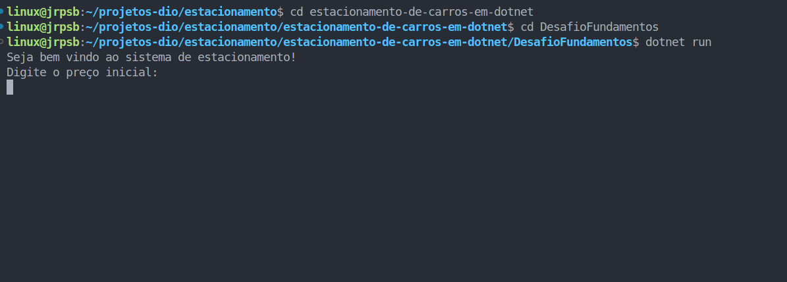 |  |
|  | 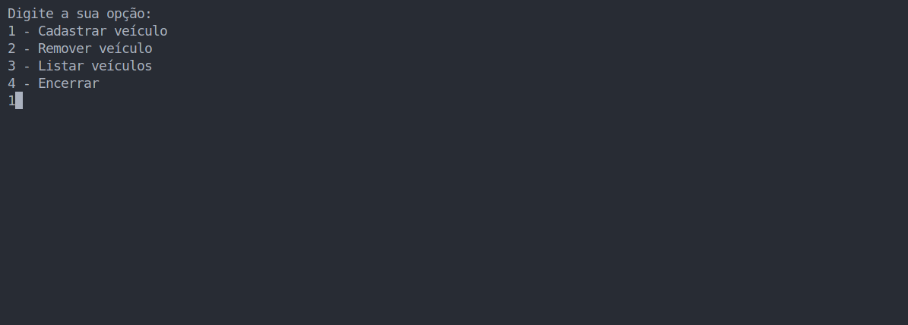 |
| 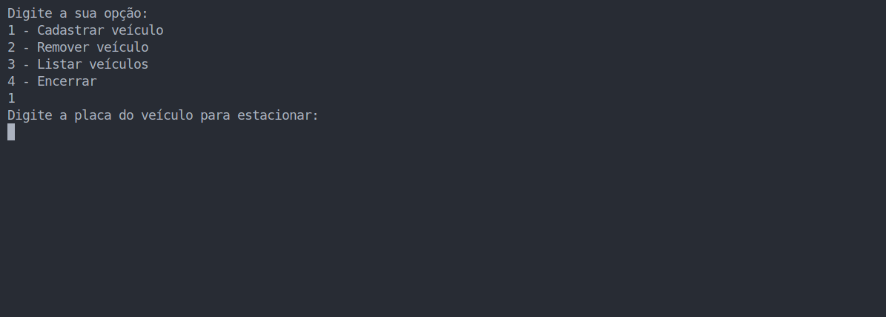 | 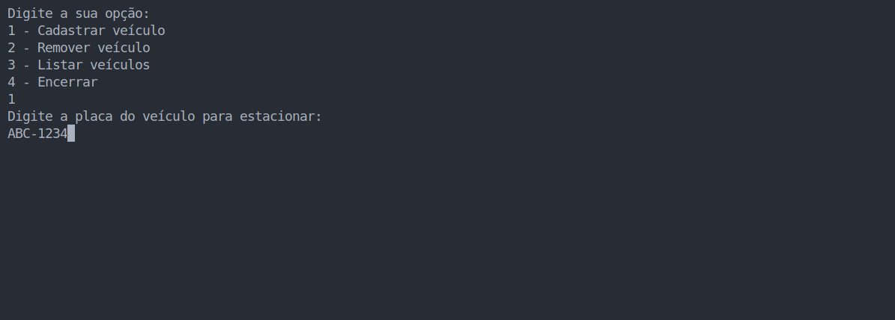 |
| 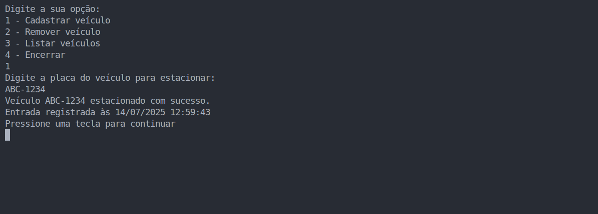 | 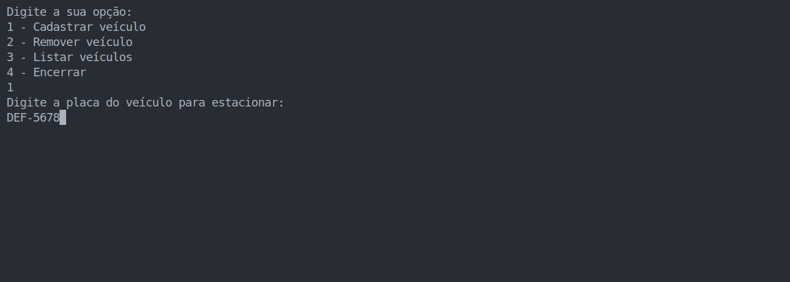 |
| 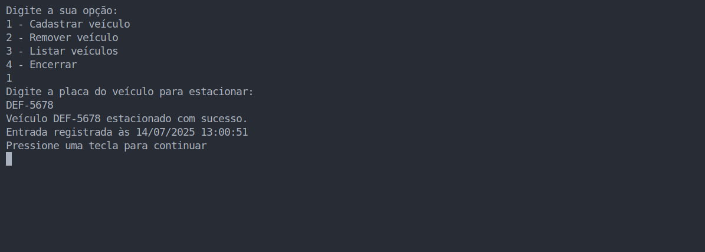 |  |
| 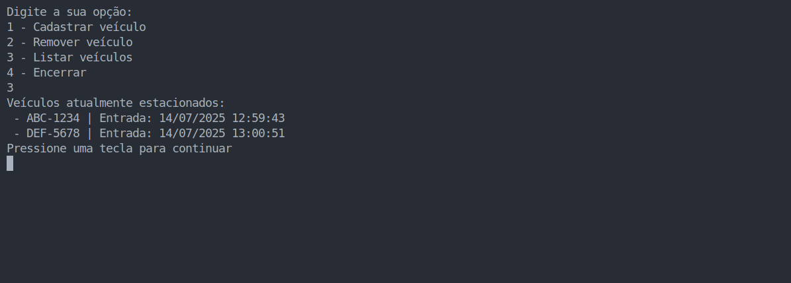 |  |
| 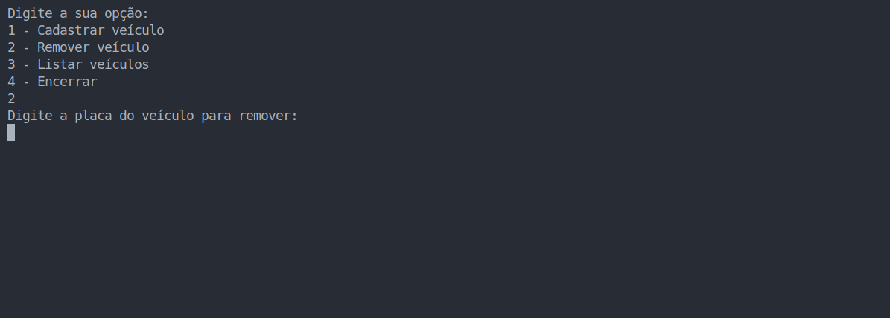 | 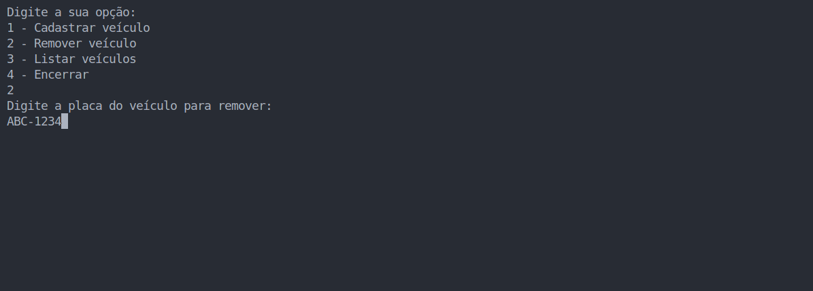 |
| 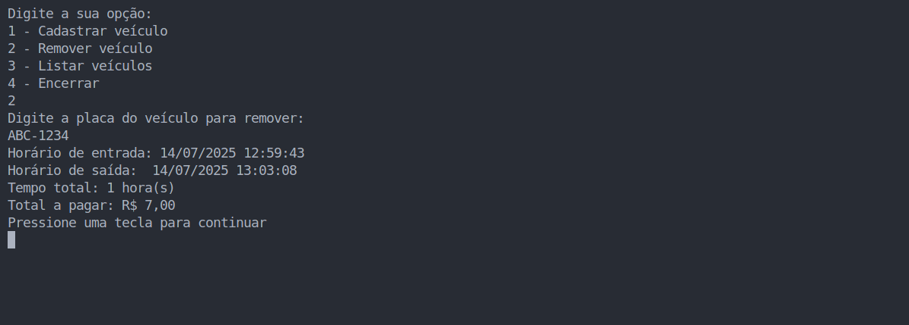 | 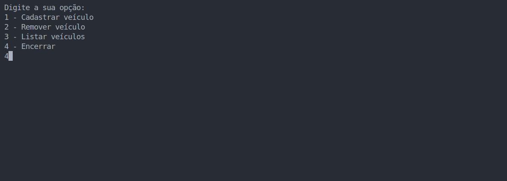 |
| 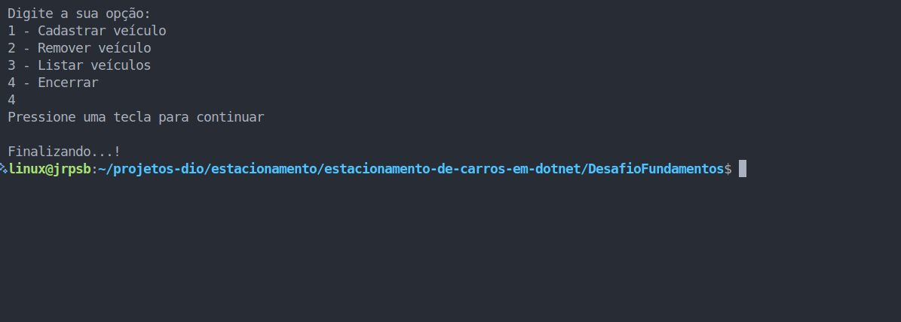 |  |

---

## 💻 Evolução para Web com ASP.NET MVC

Este projeto evoluiu para uma aplicação web funcional com Razor Pages, Bootstrap e layout responsivo.

### 🖼️ Prints da Interface Web

| Página Inicial    | Adicionar Veículo  |
|-------------------|--------------------|
| 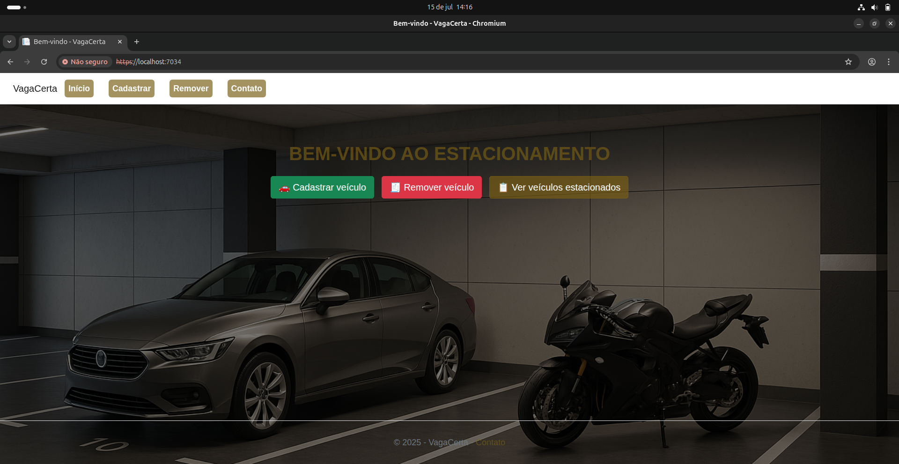 |  |

| Adicionando Veículo   | Veículo Cadastrado (Recibo) |
|-----------------------|-----------------------------|
| 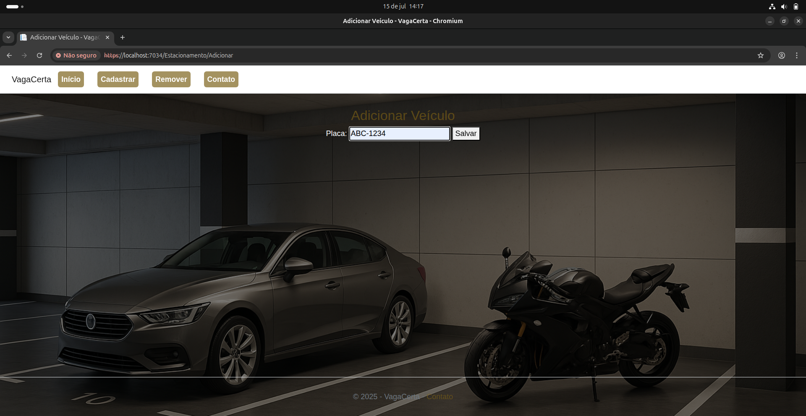 |  |

| Lista de Estacionados | Remoções e Pagamento  |
|-----------------------|----------------------|
| 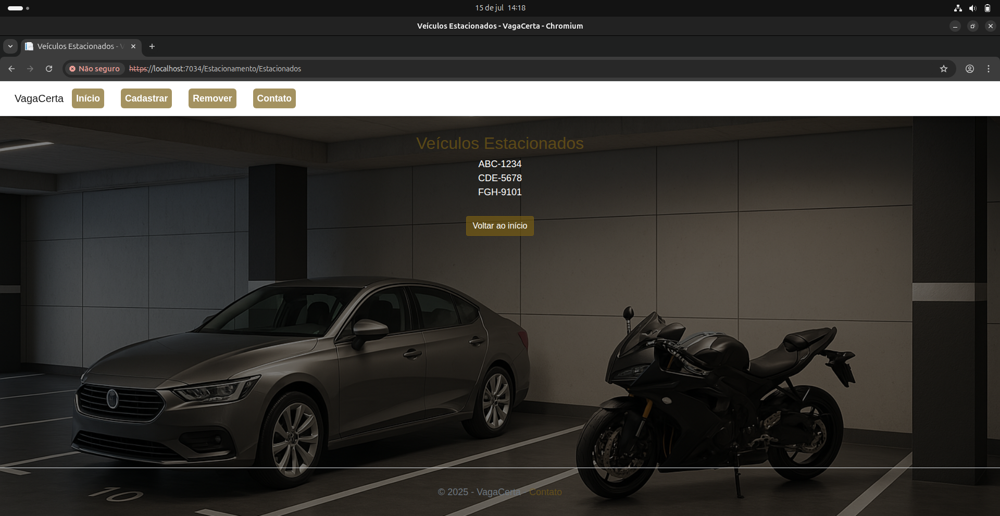 | 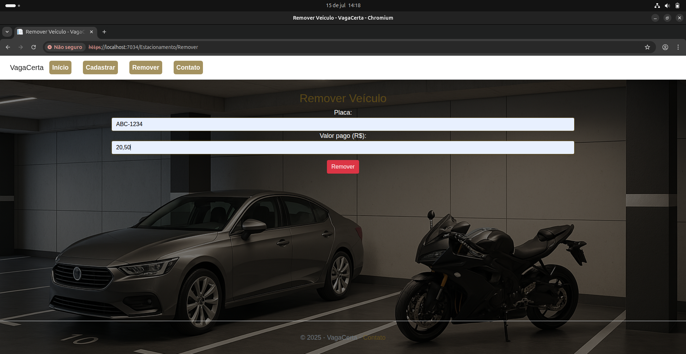 |
|                       | 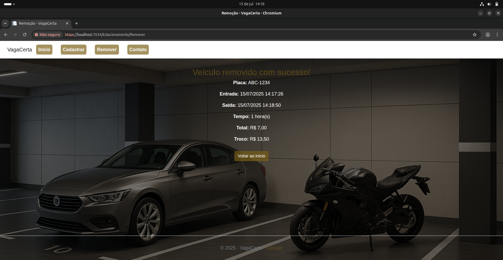 |

---

## 🧱 Estrutura da Classe Principal

```csharp
public class Estacionamento
{
    private decimal precoInicial;
    private decimal precoPorHora;
    private List<string> veiculos;

    public bool AdicionarVeiculo(string placa) { ... }

    public (decimal valorTotal, int horas, DateTime entrada, DateTime saida, decimal troco)?
        RemoverVeiculo(string placa, decimal valorPago) { ... }

    public List<string> ListarVeiculos() { ... }
}

```

---

- # 🛠️ Tecnologias Utilizadas
- # 🗂️ Estrutura de Pastas
- # 📄 Licença
+ ## 🛠️ Tecnologias Utilizadas
+ ## 🗂️ Estrutura de Pastas
+ ## 📄 Licença


---

# 🗂️ Estrutura de Pastas

```bash
EstacionamentoWebApp/
├── Controllers/
│   └── EstacionamentoController.cs
├── Models/
│   └── Estacionamento.cs
├── Views/
│   └── Estacionamento/
│       ├── Index.cshtml
│       ├── Adicionar.cshtml
│       ├── Remover.cshtml
│       ├── Removido.cshtml
│       └── Estacionados.cshtml
├── imagens/
│   ├── console-adicionar.png
│   ├── console-remover.png
│   ├── web-home.png
│   ├── web-adicionar.png
│   ├── web-remover.png
│   ├── web-removido.png
│   └── web-estacionados.png
├── wwwroot/
│   └── css/site.css (estilização personalizada)
└── README.md
```
---
# 📄 Licença
Este projeto foi desenvolvido para fins educacionais no contexto do bootcamp DIO. Livre para aprendizado e melhoria.


---

### 🔍 O que foi melhorado:

| Item | Antes | Depois |
|------|-------|--------|
| Imagens | Muitos títulos longos | Nomes curtos, layout mais limpo |
| Cabeçalhos | Sem padrão claro | Hierarquia de títulos mantida |
| Estrutura de pastas | `imagens/` fora de `docs` | Centralizado em `docs/imagens/` |
| Licença | Ausente | Adicionada (opcional, mas recomendada) |
| Diagrama | Com legenda redundante | Mais direto e fluido |


